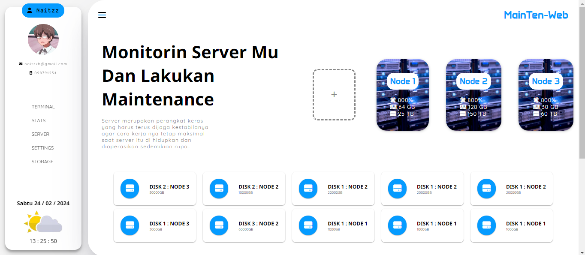

## Mainten-Web

Web Maintenance is a Web Panel / Dashboard for Server Monitoring

## Authors

- [@Naitzz12](https://github.com/Naitzz12)

## Features

- Create a new server
- Dark mode (coming soon)
- Settings
- Themes (coming soon)
- ETC

## Used By

This Project Uses:

- HTML
- CSS
- JS
- Chart.JS
- Xterm

[ ⚠️Warning ] This Web Dashboard is only for desktop, does not support Android devices | Only uses Indonesian [other languages ​​will be supported soon]
